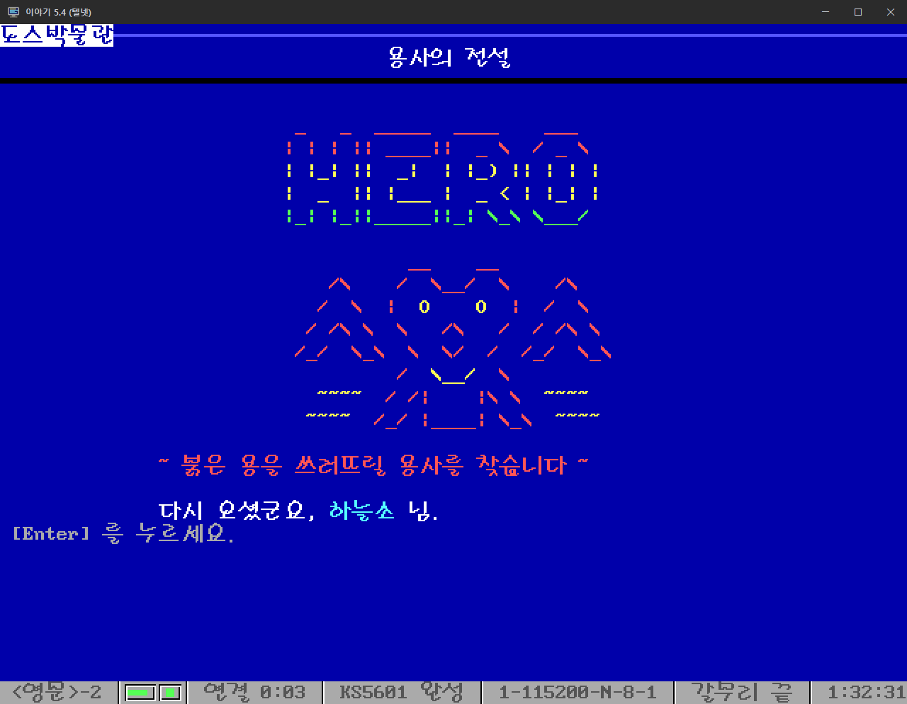
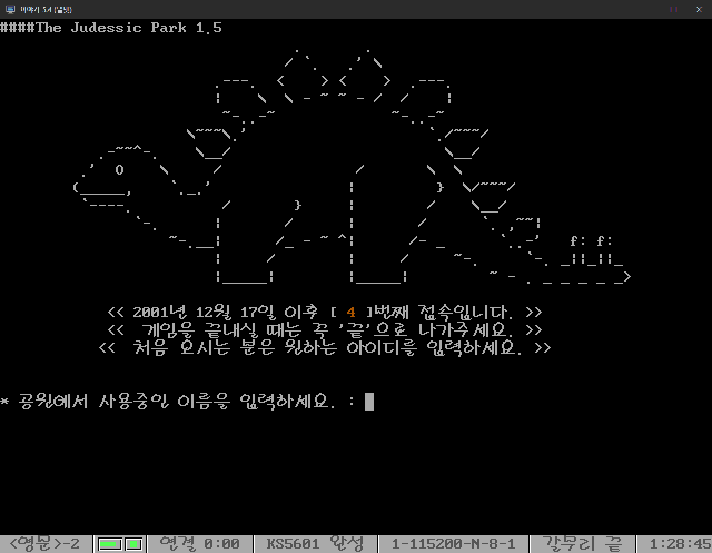

소개
-
1990년대 한국 PC통신 시절의 BBS(전자게시판)를 재현하는 프로그램입니다. 현재 CentOS 6.9 에서 개발하고 운영하고 있습니다. (https://bbsweb.oscc.kr/)

주요 기능
-
**접속과 화면**
- 텔넷 접속 (xinetd + in.telnetd), EUC-KR 완성형 한글, ANSI 색상
- 이야기 같은 옛 통신 에뮬레이터에 맞춘 화면 (80 칸, 이야기 색상 코드)
- 한글 입력 편집 (한글 한 글자 단위 백스페이스)
- 10 분 동안 입력이 없으면 자동 접속 종료
- 대문 화면에 회원 수, 접속자 수, 전체 글 수 표시
- 메뉴, 게시판, 화면 구성을 `hanulso.mnu` (XML) 와 `txt/` 화면 파일로 설정
- `GO {메뉴명}` 으로 바로 이동, `T` 초기 화면, `P` 이전 메뉴, `H` 도움말

**회원**
- 가입, 로그인, 비밀번호 찾기 (새 비밀번호를 이메일로 발송)
- 회원 정보 보기/변경 (`PF`, `PE`), 접속 중인 회원 목록 (`US`)
- 쪽지 (`MEMO`): 받은/보낸 쪽지함, 쓰기, 답장, 지우기. 로그인할 때 읽지 않은 쪽지 수 알림
- 회원 등급 (`hanulso.cfg` 의 `level`), 메뉴/게시판별 등급 제한
- 비밀번호는 SHA-512 crypt 로 저장 (예전 MySQL `PASSWORD()` 해시는 로그인할 때 자동 전환)

**게시판 / 자료실**
- 글쓰기 (`W`), 답글 (`RE`), 고치기 (`ED`), 지우기 (`DD`, 범위 지정 가능), 추천 (`OK`)
- 목록 쪽 넘기기 (`Enter`/`N`/`B`), 연속 읽기 (`PR`)
- 찾기: 제목/본문 (`LT`), 아이디 (`LI`), 닉네임 (`LN`)
- 글 작성: 줄 편집기, 화면 편집기 (pico), 텍스트 파일 올리기 (조합형 한글은 완성형으로 바꿈)
- 첨부 파일 올리기/받기 (`UP`, `DN`): Zmodem, Ymodem, Xmodem, Kermit
- 프로그램/게임/특별/음원 자료실

**대화방**
- 대화방 개설, 비밀방, 인원 제한
- 귓속말 (`/SAY`), 접속자 조회 (`/LIST`), 퇴장 (`/BYE`), 대화방 닫기 (`/QUIT`)

**생활정보** (`go life`)
- 날씨와 미세먼지: 전국 시/군/구 231 곳, 3 시간 간격 예보 (Open-Meteo)
- 뉴스: 71 개 언론사 342 개 RSS
- 환율: 22 개 통화, 원화 환산 (ExchangeRate-API)
- 만세력/음력: 양력/음력 변환, 간지/띠, 음력이 함께 나오는 달력, 다가오는 공휴일 (한국천문연구원 기준)
- 바이오리듬, 성격 유형 검사 (MBTI), 오늘의 운세 (`LUCK`)

**머드 게임** (`go game`)
- 용사의 전설: 옛 BBS 도어 게임 방식의 1 인용 텍스트 RPG
- 쥬라기공원 2: PC통신 시절 머드의 HanLP 복원판 (아래 머드 게임 항목 참고)

**운영자**
- 운영자 메뉴 (`SYSOP`): 회원 검색, 등급/비밀번호 변경, 회원 삭제, 게시물 삭제
- 글쓴이 등급 변경 (`LV`), 서버 정보 (`SYS`)

라이선스
-
이 프로그램은 LGPL 라이선스를 따릅니다.

`src/jurassic/driver` 의 머드 엔진(MudOS)과 쥬라기공원 2 복원판 머드 라이브러리(`src/jurassic/jp2_v15.tgz`)는 LGPL 대상이 아닙니다. 아래 머드 게임 항목을 참고하세요.

설치
-
설치 방법은 INSTALL.TXT 파일을 참고하세요.

### 미리 설치할 패키지 (CentOS 6 기준)

| 용도 | 패키지 |
|---|---|
| 텔넷 접속 | `xinetd` `telnet-server` |
| 빌드 | `gcc-c++` `make` `zlib-devel` `openssl-devel` |
| 데이터베이스 | `MariaDB-server` `MariaDB-client` (MariaDB 저장소), `mysql-devel` |
| 파일 올리기/받기 | `lrzsz` (Zmodem/Ymodem/Xmodem), `gkermit` (소스로 빌드) |
| 생활정보 (날씨/뉴스/환율 등) | `curl` `wget` `lynx` |
| 글자 변환, 시스템 정보 | `iconv` (glibc-common, 기본 설치), `dos2unix` `unix2dos`, `redhat-lsb-core` |
| 화면 편집기 | `nano` (소스로 빌드) |
| 머드 게임 (쥬라기공원 2) | `gcc` `bison` |

```bash
yum install xinetd telnet-server gcc-c++ gcc make bison zlib-devel openssl-devel mysql-devel lrzsz curl wget lynx dos2unix unix2dos redhat-lsb-core
```

- 한글 로캘 `ko_KR.eucKR` 이 필요합니다 (`LANG=ko_KR.eucKR`).
- `bin/mailsend` (비밀번호 찾기 메일) 는 `src/mailsend/` 의 소스를 빌드해 넣습니다 (`BUILD.TXT` 참고).
- 글쓰기 화면 편집기는 `bin/pico` 를 실행합니다. 빌드한 nano 를 `bin/pico` 로 두세요.

머드 게임
-
대문 메뉴의 **7. 머드 게임** (`go game`) 에서 두 가지 텍스트 게임을 즐길 수 있습니다.

### 1. 용사의 전설 — `go hero`

옛 BBS 도어 게임 방식의 1인용 텍스트 RPG 로, 이 BBS 를 위해 새로 만든 게임입니다. 여럿이 같은 세계에서 만나는 머드와 달리 혼자 진행하고, 다른 용사와는 순위와 마을 소식으로 이어집니다. (`src/hero.cpp`, `bin/hero`)

- 마을: 숲 사냥, 사부님과의 결투(레벨업), 대장간/갑옷 가게, 잡화점, 약방, 전장(돈 맡기기)
- 숲 사냥은 하루 15 번. 쓰러지면 지니고 있던 돈을 잃고 다음 날 깨어납니다
- 레벨 1~12, 몬스터 66 종, 무기 20 종, 갑옷 20 종, 장신구 10 종, 소모품 4 종
- 12 레벨에 붉은 용을 쓰러뜨리면 영웅 칭호를 얻고 처음부터 다시 시작합니다
- 장면마다 아스키 그림, 체력 막대가 있는 2 단 전투 화면, 함께 보는 용사 순위와 마을 소식 (MySQL `game_hero`, `game_news` 테이블)



### 2. 쥬라기공원 2 — `go jurassic`

쥬라기공원은 1994 년 천리안에서 서비스를 시작한 국내 초기 상용 머드입니다.
이 게임은 **쥬라기공원 2 의 HanLP 복원판** (JuDessic Park 1.5, 2001, MaGuN) 을 개조된 HanLP 드라이버 대신 원본 **MudOS v22.2b14** 에서 돌아가도록 옮긴 것입니다.

- `src/jurassic/driver` — [maldorne/mudos](https://github.com/maldorne/mudos) 의 MudOS v22.2b14 + 한글 수정
  - `packages/hangul.c` — HanLP 라이브러리가 쓰는 한글 조사 함수 (`han_iga` 이/가, `han_obj` 을/를, `han_tool` 으로/로 등). 완성형 2,350 자의 받침 표 사용
  - `add_action.c` — 한국어 어순: 마지막 단어를 명령으로 (`칼 가져`)
  - `backend.c` — glibc 의 `ualarm()` 이 1 초 이상 값을 거부해 heart_beat 가 돌지 않던 문제를 `setitimer()` 로 해결
  - `local_options` — HanLP 라이브러리가 기대하는 옵션 (`PACKAGE_HANGUL`, `INTERACTIVE_CATCH_TELL` 등)
- `src/jurassic/jp2_v15.tgz` — 원본 머드 라이브러리 (EUC-KR)
- `src/jurassic/libpatch` — 설치할 때 원본 위에 덮어쓰는 파일: 원래 HanLP 드라이버에 있던 함수(`ktime`, 전투 메시지 등)와 운영자 설정
- `build.sh` 로 엔진을 빌드하고 (기본 64 비트, `BITS=32` 로 32 비트), `deploy.sh` 로 라이브러리와 함께 설치하며, `bin/startmud` 가 머드를 계속 띄워 둡니다
- 머드는 `127.0.0.1:4444` 에서 접속을 받습니다. BBS 는 `bin/mudlink` (`src/mudlink.cpp`) 로 사용자를 연결합니다. 이 프로그램은 로컬 머드 포트에만 접속하고, 줄 입력과 한글 백스페이스, 비밀번호 숨김을 처리하며, `끝` 이나 `/x` 로 BBS 에 돌아옵니다.

빌드, 설치, 업데이트, 운영자 설정은 INSTALL.TXT 의 **머드 게임 연결** 을 참고하세요.



출처와 라이선스:
- MudOS 의 저작권은 Lars Pensjö, Erik Kay, Adam Beeman, Stephan Iannce, John Garnett, Tim Hollebeek 에게 있으며 **금전적 이익을 위해 사용할 수 없습니다** (`src/jurassic/driver/Copyright`). 비상업 용도로만 운영하세요.
- 쥬라기공원 2 복원판은 MaGuN (HanLP) 이 만들었고, 크루젼(이상신)님과 꼬마기사(김진태)님이 나우누리 머드동호회에 공개한 구공원 라이브러리의 지역 데이터를 사용했습니다. 원작 쥬라기공원은 송재경, 김성배 님이 만들었습니다. 원작의 권리 관계는 확인되지 않았습니다.
